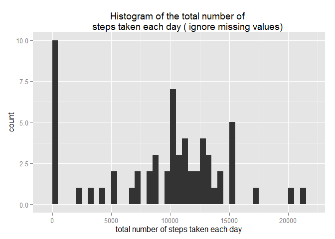
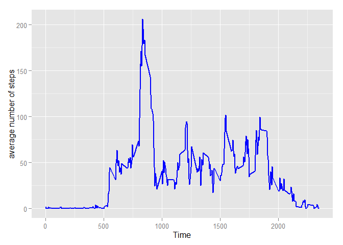
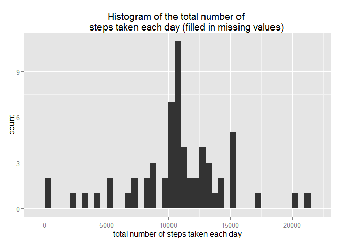
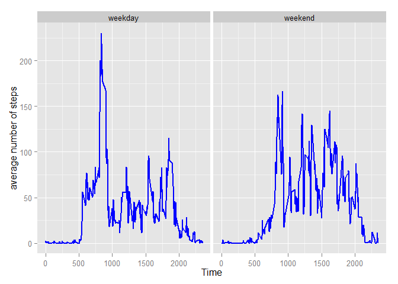

# Reproducible Research: Peer Assessment 1
## Loading and preprocessing the data


```r
# Loading the data
rawdata <- read.csv('activity.csv', head = TRUE,na.strings = "NA")

# convert the date variable from character to date format
rawdata$date <- as.Date(rawdata$date,'%Y-%m-%d')
```

## What is mean total number of steps taken per day?
For this part of the assignment, We ignore the missing values in the dataset. 

1. We first give the histogram of the total number of steps taken each day as follow:


```r
sum_date <- aggregate(x = rawdata$steps, by = list(rawdata$date), FUN = "sum",na.rm = TRUE)
colnames(sum_date) <- c("date","sum")

require(ggplot2)
```

```
## Loading required package: ggplot2
```

```r
p1 <- ggplot(sum_date) + geom_histogram(aes(x = sum), binwidth = 500) +
       labs(x = 'total number of steps taken each day',title = 'Histogram of the total number of 
       steps taken each day ( ignore missing values)')
print(p1)
```

 

2. We then calculate and report the mean and median total number of steps taken per day

```r
sum_date_AVe <- c(mean(sum_date$sum, na.rm = TRUE), median(sum_date$sum, na.rm = TRUE))
names(sum_date_AVe) <- c("mean","median")
# the mean and median
sum_date_AVe
```

```
##     mean   median 
##  9354.23 10395.00
```

## What is the average daily activity pattern?
1. To investigate the daily activity patternmake, we give a time series plot of the 5-minute interval and the average number of steps taken averaged across all days.

```r
# calculate the mean of steps taken of each 5-minute interval across all days
Avg_interval <- aggregate(x = rawdata$steps, by = list(rawdata$interval), FUN = "mean",na.rm = TRUE)
colnames(Avg_interval) <- c("interval","mean")

# time series plot
p2 <- ggplot(Avg_interval) + geom_line(aes(x = interval, y = mean), colour = "blue",
       size = 0.75) +labs(x = 'Time', y = 'average number of steps')
print(p2)
```

 

2. Which 5-minute interval, on average across all the days in the dataset, contains the maximum number of steps?  

```r
maxId <- which.max(Avg_interval$mean)
c(Avg_interval$interval[maxId],Avg_interval$interval[maxId+1])
```

```
## [1] 835 840
```
We can find that the interval from 835 to 840 contains the maximum number of steps.

## Imputing missing values
1. The total number of missing values in the dataset is 2304.

```r
sum(is.na(rawdata$steps))
```

```
## [1] 2304
```

2. We fill in all of the missing values in the dataset by using the mean for that 5-minute interval across all days.

```r
filldata <- rawdata
for (i in 1:length(filldata$steps)) {
    if (is.na(filldata$steps[i])) {
        fIndex <- Avg_interval$interval==filldata$interval[i]
        fvalue <- Avg_interval$mean[fIndex]
        filldata$steps[i] <- fvalue 
    }
}
```

3. We create a new dataset named _filldata_ that is equal to the original dataset but with the missing data filled in.

4. We then give the histogram of the total number of steps taken each day after filling in the missing data.

```r
sum_date2 <- aggregate(x = filldata$steps, by = list(filldata$date), FUN = "sum",na.rm = TRUE)
colnames(sum_date2) <- c("date","sum")

p3 <- ggplot(sum_date2) + geom_histogram(aes(x = sum), binwidth = 500) +
  labs(x = 'total number of steps taken each day',title = 'Histogram of the total number of 
       steps taken each day (filled in missing values)')
print(p3)
```

 

The mean and median total number of steps taken per day are calculated as follow:


```r
sum_date_AVe2 <- c(mean(sum_date2$sum, na.rm = TRUE), median(sum_date2$sum, na.rm = TRUE))
names(sum_date_AVe2) <- c("mean","median")
# the mean and median
sum_date_AVe2
```

```
##     mean   median 
## 10766.19 10766.19
```
These values are bigger than the estimates from the first part of the assignment.

## Are there differences in activity patterns between weekdays and weekends?
1. We create a new factor variable in the dataset with two levels -- "weekday" and "weekend" indicating whether a given date is a weekday or weekend day.

```r
# Setting the LC_TIME to fix the flaw that DateTime label shown in Chinese
Sys.setlocale(category = "LC_TIME", locale = "C")
```

```
## [1] "C"
```

```r
WeekdaysFactor <- rep(weekdays(sum_date2$date),each = length(Avg_interval$interval))

WwdaysFactor <- WeekdaysFactor
for (k in 1:length(WwdaysFactor)) {
    if (substr(WwdaysFactor[k],1,1) == "S") {
      WwdaysFactor[k] = "weekend"      
    }
    else {
      WwdaysFactor[k] = "weekday"
            
    }  
} 

filldata$weekday <- WwdaysFactor
```

2. We make a panel plot containing a time series plot of the 5-minute interval (x-axis) and the average number of steps taken, averaged across all weekday days or weekend days. 

```r
Avg_interval2 <- aggregate(x = filldata$steps, by = list(filldata$interval,filldata$weekday), FUN = "mean",na.rm = TRUE)
colnames(Avg_interval2) <- c("interval","weekday","mean")

p4 <- ggplot(Avg_interval2) + geom_line(aes(x = interval, y = mean), colour = "blue",
      size = 0.75) +labs(x = 'Time', y = 'average number of steps') + 
      facet_wrap(~weekday)
print(p4)
```

 

Obviously there is differences in activity patterns between weekdays and weekends according to the figure above. On average, the ower of this activity monitoring device take more steps from 500 minites to 1000 minites in weekdays. There is a apparent motion peak in the weekday morning.
